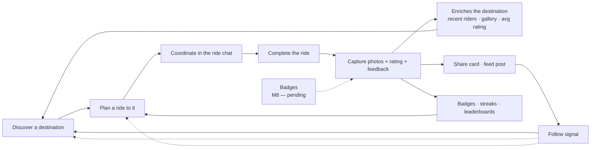
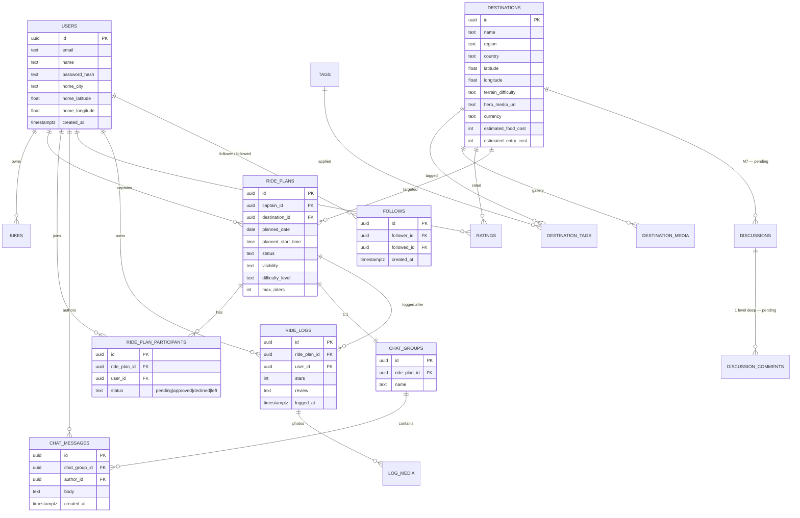
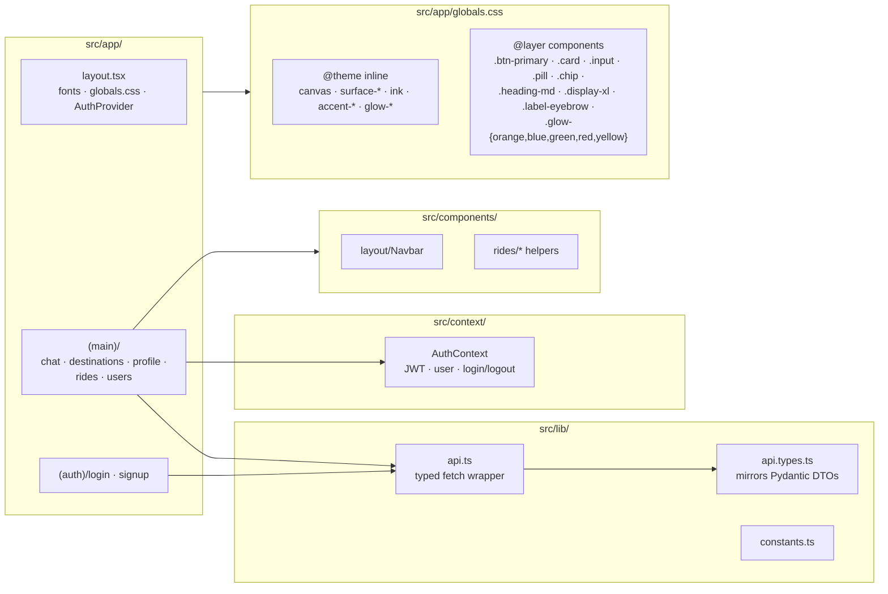
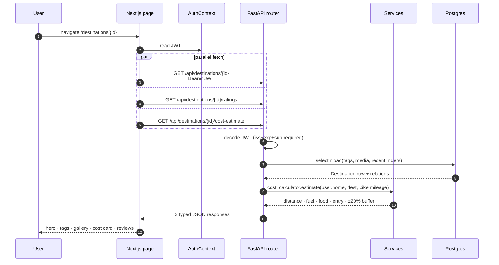
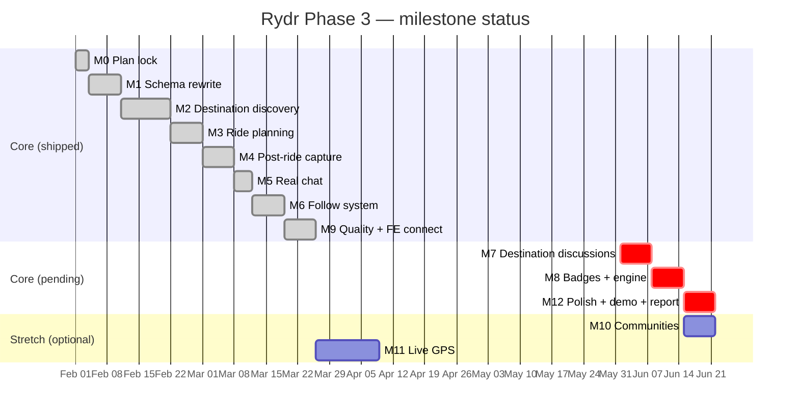

# Rydr — Architecture & Roadmap

*Snapshot date: 2026-08-28 · Phase 4 complete · Branch: `main`*

Rydr is an academic project: a destination-first community platform for motorcycle riders. This document captures **what's actually built right now**, the design intent behind it, and the planned path forward. Diagrams are Mermaid and render in any markdown viewer with Mermaid support.

Phase 4 added the community layer, gamification, real-time chat, maps, moderation and the Android shell. For what shipped week by week and what did not, see [plan/phase4-completion.md](./plan/phase4-completion.md).

---

## 1. TL;DR

- **Backend** — FastAPI + SQLAlchemy 2 + PostgreSQL 15 + Alembic.
- **Frontend** — Next.js 16 (App Router, Turbopack) + React + Tailwind 4 styled with the *Resend* dark design system (pure black canvas, white pill primary CTAs, hairline borders, atmospheric glows).
- **Auth** — JWT (HS256) with hardened claims (`iss=rydr`, `exp`/`sub`/`iss` required on decode).
- **Media** — Cloudinary for ride photos / destination galleries (signed direct-from-browser uploads).
- **Maps** — OpenStreetMap tiles + OSRM routing + Nominatim geocoding, behind a provider interface with a Mapbox adapter that activates on `MAPBOX_TOKEN`.
- **Real-time** — FastAPI WebSockets for ride chat, with the REST polling path retained as the fallback.
- **Android** — Capacitor wrapping a static export of the same frontend. Never compiled here (no SDK); see [plan/phase4-android-release.md](./plan/phase4-android-release.md).
- **Phase 3 milestones shipped**: M0 → M9. **Phase 4 shipped**: W1 → W11, with push delivery, Sentry and the signed AAB blocked on external accounts.
- **Core thesis**: *destination-first*. Every social signal flows back to the destination — ratings, photos, recent-rider proof, follower activity, eventually badges.

---

## 2. The "flywheel" (product mental model)



Each loop strengthens the *destination* as the canonical noun. Phase 3 is the first cut where this loop closes end-to-end.

---

## 3. System architecture

```mermaid
flowchart TB
    subgraph Client["Browser (Next.js 16 PWA)"]
        UI[App Router pages<br/>app/(auth) + app/(main)]
        AuthCtx[AuthContext<br/>JWT in localStorage]
        ApiSdk[lib/api.ts<br/>typed fetch wrapper]
        UI --> AuthCtx
        UI --> ApiSdk
    end

    subgraph Edge["Cloudinary"]
        CloudUp[Signed direct upload]
        CloudCDN[CDN delivery]
    end

    subgraph Server["FastAPI (uvicorn)"]
        CORS[CORS + auth middleware]
        Routers[Routers<br/>auth · users · destinations · rides ·<br/>chat · ride_logs · tags]
        Services[Services<br/>auth · cloudinary · cost_calc ·<br/>geo · ride_helpers · user_view]
        Schemas[Pydantic schemas<br/>request + response DTOs]
        ORM[SQLAlchemy 2.0 models]
        CORS --> Routers
        Routers --> Schemas
        Routers --> Services
        Routers --> ORM
        Services --> ORM
    end

    DB[(PostgreSQL 15<br/>Alembic-managed)]

    UI -- fetch + Bearer JWT --> CORS
    ApiSdk -- multipart sig --> CloudUp
    CloudUp -- async webhook URL --> Routers
    UI -- img src --> CloudCDN
    ORM --> DB
```

**Key boundaries**
- The browser never sees a Cloudinary secret — backend signs the upload params; browser PUTs directly to Cloudinary; backend persists the resulting URL.
- The frontend has zero direct SQL — it only knows DTO shapes from `lib/api.types.ts` (mirrored from Pydantic).
- All HTTP traffic goes through the same FastAPI app — no separate microservices.

---

## 4. Backend module map

From the code-review-graph: **12 communities, 419 nodes, 4 216 edges, 77 source files** (across `python · typescript · javascript · tsx · bash`).

```mermaid
flowchart LR
    subgraph App["app/"]
        Main[main.py<br/>CORS · routers · health]
        Deps[deps.py<br/>get_current_user · DB session]
        Config[core/config.py<br/>pydantic-settings]
        Security[core/security.py<br/>JWT encode/decode · bcrypt]
    end

    subgraph Routers["app/routers/"]
        AuthR[auth.py]
        UsersR[users.py + follow]
        DestR[destinations.py]
        RidesR[rides.py + participants]
        ChatR[chat.py]
        LogsR[ride_logs.py]
        TagsR[tags.py]
    end

    subgraph Models["app/models/"]
        UserM[user.py]
        DestM[destination.py<br/>Destination · Tag · Rating · Media]
        RideM[ride.py<br/>Bike · RidePlan · Participant]
        ChatM[chat.py<br/>ChatGroup · ChatMessage]
        LogM[ride_log.py<br/>RideLog · LogMedia]
        SocialM[social.py<br/>Follow · Discussion · Comment]
        BadgeM[badge.py<br/>scaffolded — not wired]
    end

    subgraph Services["app/services/"]
        AuthS[auth_service.py]
        CloudS[cloudinary_service.py]
        CostS[cost_calculator.py<br/>haversine + fuel + buffers]
        GeoS[geo.py<br/>radius filters]
        RideS[ride_helpers.py<br/>approved-participant count etc.]
        UserS[user_view.py<br/>stats projection]
    end

    Main --> Routers
    Routers --> Deps
    Routers --> Services
    Routers --> Models
    Services --> Models
    Deps --> Security
    Deps --> Config
```



**Coupling notes (from graph warnings)**

| Pair | Edges | Reading |
|---|---|---|
| `app` ↔ `routers` | 81 | Expected — routers reference deps/security/config heavily. |
| `models` ↔ `routers` | 59 | Expected — routers compose ORM queries inline (no repository layer, by design). |
| `routers` ↔ `schemas` | 21 | Expected — every endpoint declares a response_model. |

We deliberately kept routers thin-but-not-empty (no repository pattern) to stay readable for the academic report. If the project ever grows, the natural next refactor is to extract per-aggregate "service-modules" and shrink router files.

---

## 5. Database schema (current)



**Migration history** (Alembic):
1. `3c0a0b736b45` — initial schema
2. `b4e6c8f2a1d3` — M1 destination schema (rewrite around `Destination`)
3. `e5f7d9a3c6b2` — M3 ride participant unique
4. `f1a2b3c4d5e6` — M4 ride log unique (one log per user per ride)
5. `a7b2c9d4e1f5` — M6 follow indexes
6. `c3d8e6f4b9a2` — M6 ride-plans captain index

---

## 6. Frontend module map



**Design system — Resend (dark)**
- Canvas `#000000`; surface tokens (`surface-card`, `surface-elevated`, `surface-deep`) climb the elevation ladder.
- Text scale: `ink` (off-white #fcfdff) → `body` → `charcoal` → `mute` → `ash` → `stone`.
- **No drop shadows** — depth comes from hairline borders (`rgba(255,255,255,0.06)` / `0.14`) + glows.
- Primary CTA: white pill, black text (`bg-ink text-canvas`). The screenshot bug where avatars/icons appeared invisible was a duplicate-class issue — `text-ink` overriding `text-canvas` on the same element — now scrubbed.
- Fonts (`next/font/google`): Inter (body), Inter Tight (display), Geist Mono (numeric/code).

---

## 7. Request lifecycle (concrete example)

A user opens a destination detail page. This is the most-coupled flow in the app and a fair stress-test of the design.



Notes:
- N+1 avoidance via `selectinload` on tags/media/recent-riders.
- `recent_rider_count` and `avg_rating` are scalar subqueries on the main row, not aggregated client-side.
- Cost calc returns `fuel_included: false` if the user has no bike mileage — the UI shows a nudge to fill the profile instead of a misleading total.

---

## 8. Cross-cutting concerns

| Concern | Where it lives | Notes |
|---|---|---|
| Auth | `core/security.py` + `deps.get_current_user` | JWT HS256, `iss="rydr"` required on decode; `JWT_SECRET` must not equal default in `staging`/`prod`. |
| Idempotency | Atomic upserts via `pg_insert(...).on_conflict_do_nothing/update(...)` | Join/leave a ride, follow/unfollow, post rating — all 201/200 on retry, no client state confusion. |
| N+1 protection | `selectinload` + scalar subqueries | Enforced in destination list/detail, ride detail, chat list. |
| Pagination | Query params `limit ≤ 50`, `offset` | Reason a screenshot bug surfaced: frontend was asking for `limit=100`. Cap is intentional. |
| 404 vs 403 leak | Chat group returns 404 to non-members | Don't confirm group existence to outsiders. Frontend renders friendly empty-state instead of dead link. |
| Real-time | Chat over `WS /api/chat/groups/{id}/ws` (Phase 4 W6); the `after_id` poll is retained and runs only while the socket is down | Both paths persist through the same model, and messages are de-duplicated on id client-side. Registry is in process memory, so the deployment runs one uvicorn worker. |
| Notifications | `services/notifications` — one `notify()` with the don't-notify-yourself rule and a SAVEPOINT per delivery | A notification failure cannot break the action that triggered it. Bell polls the unread count on a 60 s tick rather than holding a second socket. |
| Capacity | `services/ride_capacity` — row lock on `ride_plans` before any seat-consuming write | `max_riders` is binding; the waitlist drains FIFO by `updated_at`. |
| Estimated distance | `services/stats` (SQL) and `stats.estimated_ride_km` (Python), both on `geo.EARTH_RADIUS_KM` | No GPS track exists. Every distance is home→destination→home great-circle and is labelled an estimate in the UI. |
| Admin | `dependencies.require_admin` → 403 (not 404) | The admin surface is documented, so hiding it buys nothing; granted only by `scripts/grant_admin.py`. |
| File upload | Cloudinary signed direct upload | Backend never proxies the bytes; only signs params and stores the returned URL. |
| Hairline borders | `--color-hairline` / `-strong` tokens | Replaces shadows everywhere; one knob if we ever want lighter/heavier separation. |

---

## 9. Milestone status (Phase 3)



| M | Status | Plan file | Notes |
|---|---|---|---|
| M0 | ✅ shipped | (PHASE3_PLAN.md) | Stack + scope locked. |
| M1 | ✅ shipped | `docs/plan/m1-schema-rewrite.md` | Destination-centric rewrite, reseed pipeline. |
| M2 | ✅ shipped | `docs/plan/m2-destination-discovery.md` | Filters: tag · radius · vehicle · budget. Cost calculator live. |
| M3 | ✅ shipped | `docs/plan/m3-ride-planning.md` | Captain approval workflow + atomic participant upsert. |
| M4 | ✅ shipped | `docs/plan/m4-post-ride-capture.md` | Cloudinary, rating, feedback → destination enrichment. |
| M5 | ✅ shipped | `docs/plan/m5-real-chat.md` | Real chat, 404-on-non-member, after_id polling. |
| M6 | ✅ shipped | `docs/plan/m6-follow-system.md` | Follow / unfollow, `/users/:id/followers` + `/following`. |
| M7 | ⏳ pending | — | Destination-scoped threads, one level deep. Model scaffolded in `social.py`; still the only unrouted model. |
| M8 | ✅ shipped | `docs/plan/m8-badges.md` | Badge engine + 8 seeded badges, awarded from ride/log/approval triggers. |
| M9 | ✅ shipped | `docs/plan/m9-quality-and-frontend-connect.md` | JWT hardening, smoke suite (85 endpoints green), Resend theme, typed API client. |
| M10 | ⏸ stretch | — | Communities (create/join, public/private). |
| M11 | ⏸ stretch | — | Live GPS sharing. |
| M12 | ⏳ pending | — | Polish + demo script + Phase 3 report. |

### 9.1 Phase 4 (Jun 6 – Aug 29 2026)

| Wk | Deliverable | Status |
|---|---|---|
| W1 | Codebase audit + plan reconciliation | ✅ `docs/plan/phase4-web-and-android.md` |
| W2 | Maps, routing, geocoding, pins | ✅ OSM default, Mapbox behind a token |
| W3 | Video + thumbnail derivation + CDN negotiation | ✅ |
| W4 | Feed (posts/likes/comments), ride summary, share cards | ✅ |
| W5 | Notifications, leaderboards, stats dashboard | ✅ |
| W6 | WebSocket chat, ride capacity + waitlist | ✅ |
| W7 | Moderation queue, 11 measured indexes, 89-test suite | ✅ |
| W8 | Dockerised stack, staging compose, JSON logs + health probes | ✅ (Sentry not wired — needs an account) |
| W9 | Mobile pass, query-param routes, static export, Capacitor shell | ✅ (never compiled — no SDK here) |
| W10 | Native camera; push client | ✅ / ⚠️ push delivers nothing without Firebase |
| W11 | Signed AAB + Play internal track | ❌ handed off — `docs/plan/phase4-android-release.md` |

Full record, including the eleven defects fixed along the way and the
regression results: [plan/phase4-completion.md](./plan/phase4-completion.md).

---

## 10. What's NOT in the system right now

Honest list — easier to defend in the report than to discover at demo time.

Resolved in Phase 4: websockets, a pytest suite (89 tests), the badge
engine, the trigram search index, maps, and ETag/304 (on share cards).
What remains genuinely absent:

- **No rate limiting**. `slowapi` was considered for M9 and again for W7, deferred both times. Trivial to add at the router layer when the first abuse appears.
- **No soft delete** on chat messages or posts. Hard delete only. The moderation *record* does outlive deleted content, deliberately, so the audit trail survives.
- **No discussion threads**. `Discussion` / `DiscussionComment` remain the only scaffolded-but-unrouted models. Phase 4's feed covers the social need differently — a timeline rather than per-destination threads — so this is now a genuine product decision rather than a backlog item.
- **No GPS track**. All distance is derived; see §8.
- **No multi-worker chat**. In-process socket registry; needs Redis pub-sub to scale out.
- **No push delivery**. Client complete, no Firebase project.
- **No error-tracking SDK**. Structured JSON logs with request-id correlation instead.
- **No in-app account deletion**. Required by Play before production release.

---

## 11. Future plans

Ordered by current intent. Each item lists the *trigger* — i.e., the thing that has to be true before we'd start it.

### 11.1 Short-term (close out Phase 3)

1. **M7 — Destination discussions** *(trigger: nothing — next up)*
   - Per-destination thread list, one level deep replies, owner can delete own.
   - Model already in `social.py` (`Discussion`, `DiscussionComment`). Need router + UI.
   - Frontend: tab on destination detail page; reuse `.card` + chat-style bubbles.

2. **M8 — Badges + engine** *(trigger: M7 done OR parallel ownership split)*
   - 6–8 seeded badges (e.g., *First Ride*, *5 Destinations*, *100km*, *Captain x3*).
   - Trigger model: post-commit hook on `RideLog` / `RidePlan` writes → evaluate predicate set → award.
   - Visible on profile, on destination detail ("badges earned here").

3. **M12 — Polish + demo + Phase 3 report** *(trigger: M7 + M8 done)*
   - Demo script with 3 personas (Skandagiri sunrise / Coorg long-weekend / discussions thread).
   - Phase 3 academic report — defends the React-Native → Next.js PWA pivot, the destination-first thesis, and the scope cuts.

### 11.2 Medium-term (stretch, may or may not ship in Phase 3)

4. **M10 — Communities** *(trigger: M8 done AND remaining timeline ≥ 1 week)*
   - Create/join community, email invite, public/private.
   - Communities scope rides + discussions — i.e., a *Bangalore Riders* community feed is the union of its members' destinations.

5. **M11 — Live GPS sharing** *(trigger: M10 done AND timeline ≥ 2 weeks)*
   - Captain "starts" the ride → app reports position every 30–60 s.
   - Group sees markers on a Mapbox layer. Battery/accuracy tuning needed.
   - **Biggest risk** in the entire roadmap — would cut without guilt if M9/M12 slip.

### 11.3 Long-term (post-Phase 3, future thesis cycles)

Five of the items that were here have shipped in Phase 4 and are struck
from the list: real-time chat (W6), the pytest suite (W7), moderation
tooling (W7), the native mobile shell (W9), and the trigram search index
(W7). What is left:

6. **Rate limiting + abuse controls** — `slowapi` per IP + per user; chat throttle (1 msg/s, 30/min burst). Deferred twice now; the trigger is the first real abuse.
7. **Multi-worker chat** — Redis (or Postgres `LISTEN/NOTIFY`) pub-sub between workers. `services/ws_manager.broadcast` is the only function that changes. Trigger: more than one backend replica.
8. **Push delivery** — the client is complete; needs a Firebase project, a service-account credential and a device-token endpoint. See `docs/plan/phase4-android-release.md` §4.
9. **Error tracking** — `app/observability.py` is where a Sentry SDK would initialise. Trigger: a staging deploy that anyone other than the team uses.
10. **Recommendations** — the trigram index covers search; `pg_vector` embeddings on description + tags become interesting past ~500 destinations.
11. **Multi-region** — destinations are geography-agnostic by design, but the cost calculator assumes INR fuel pricing. Generalize when we have a non-India destination.
12. **Account deletion** — required by Play before production release, and the right thing regardless.
13. **Destination discussions** — the `Discussion` model is still unrouted. Phase 4's feed addresses the social need as a timeline instead; revisit only if per-destination threads prove distinct.

---

## 12. How this document stays honest

- **Source of truth for code state**: the code-review-graph (`mcp__code-review-graph__*` tools). Auto-rebuilds on file change via session-start hook (currently 419 nodes / 4 216 edges).
- **Source of truth for plans**: `docs/plan/m{N}-*.md`. Plan files only exist for *finalized* milestones — we don't pre-write stubs for future M's.
- **Source of truth for thesis + scope**: `PHASE3_PLAN.md` at repo root for Phase 3; `docs/plan/phase4-web-and-android.md` for the Phase 4 reconciliation and `docs/plan/phase4-completion.md` for its outcome.
- **Bridge between them**: this doc. Update on each milestone close, not mid-milestone.
